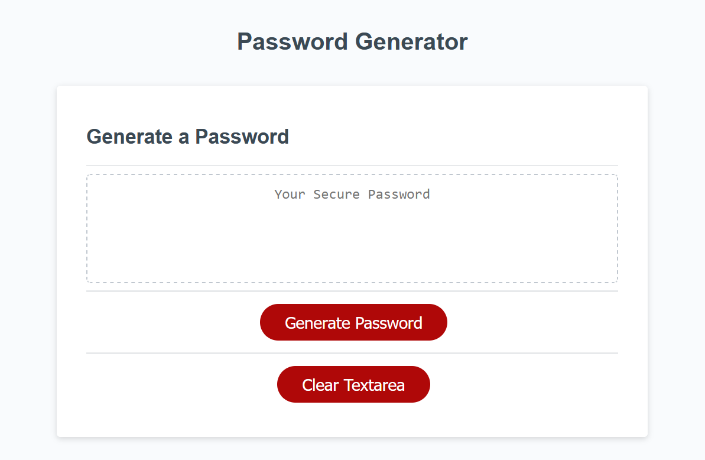
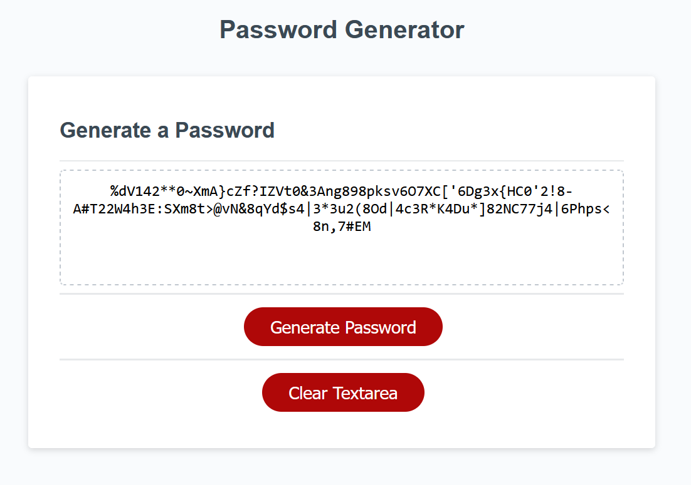

# Password_Generator
We will create password generator using html,css and javascript.Starter code is already given i need to work on java script mainly.
## Intermediate JavaScript: Password Generator
You'll create an app that runs in the browser and features dynamically updated HTML and CSS, all powered by JavaScript code that you will write. Your app will have a clean and polished user interface that is responsive, ensuring that it adapts to multiple screen sizes.

## Instructions
        application must:

    Generate a password when the button is clicked.

    Present a series of prompts for password criteria:

    Length of password:

    At least 8 characters but no more than 128.

    Character types:

    Lowercase

    Uppercase

    Numeric

    Special characters ($@%&*, etc.)

    Code should validate for each input and at least one character type should be selected.

    Once all prompts are answered, the password should be generated and displayed in an alert or written to the page.

## Screenshots

## Installation
No installation required

## contributions
only one  contribution
## copyright

&copy; Happy17594. All rights reserved